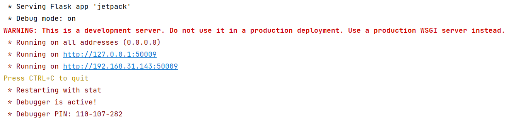
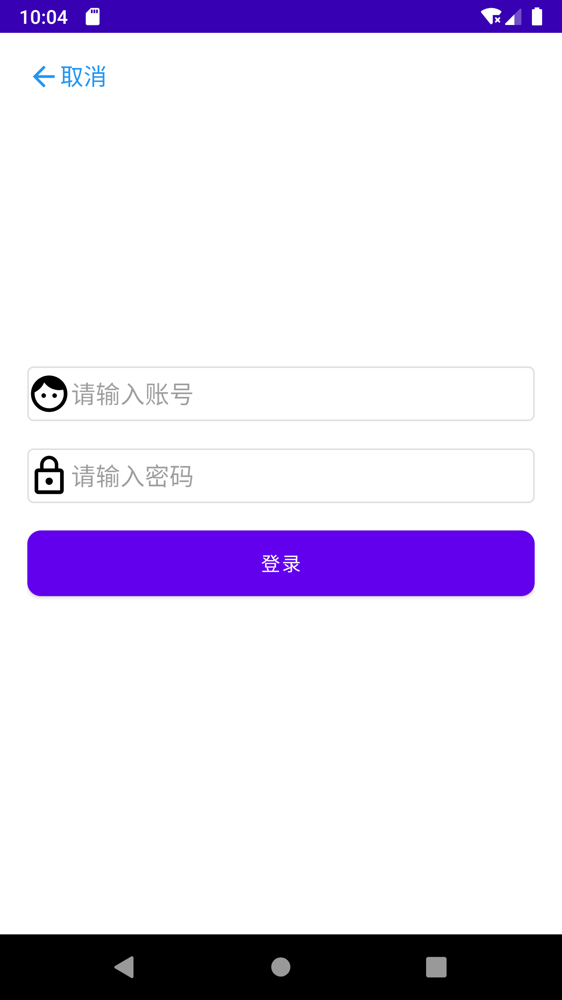
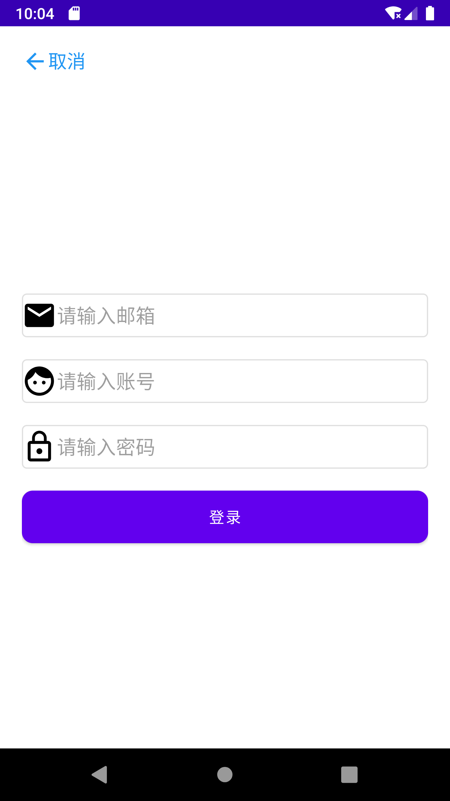

# Jetpack练习项目
## 一.涉及技术
1. Room
2. Navigation
3. Paging
4. Retrofit
5. Glide
## 二.使用方法
1. 接口的使用

   - 新建空白Python项目
   - 将jetpack.py和movie.db复制到项目中
   - 安装Flask包
   - 修改movie.db的路径
   - 运行

   
2. 应用使用

   - 替换HttpConfig中的接口地址

   - 直接使用Android Studio编译运行

## 三.界面截图
- 欢迎页面

  

- 登陆界面

  

- 注册界面

  

- 电影列表界面

  

- 喜欢界面

  